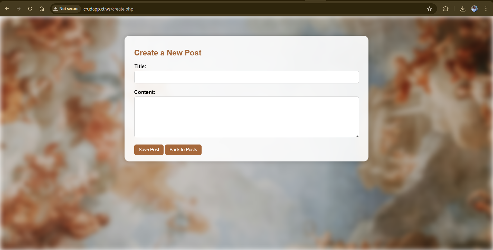

# Simple PHP CRUD App

A basic **Create, Read, Update, Delete (CRUD)** web application built with **PHP** and **MySQL**, styled with custom **CSS**. This app allows users to manage a list of posts — including adding new posts, editing existing ones, and deleting them.

---

## 📌 Features

- ✅ Add new posts  
- 📝 Edit existing posts  
- ❌ Delete posts  
- 📄 Paginated post listing  
- 🎨 Blurred background image with styled interface

---

## 📷 Screenshot



---

## 🚀 Getting Started

### Prerequisites

- PHP (7.4 or higher recommended)  
- MySQL or MariaDB  
- Web server (e.g. Apache)  
- [XAMPP](https://www.apachefriends.org/) or similar development stack

---

### 🛠️ Installation

1. **Clone the repository:**

   ```bash
   git clone https://github.com/burningtonemwatha/CRUD-App.git
   ```

2. **Move it to your web root directory** (e.g. `htdocs` if you're using XAMPP):

   ```
   C:\xampp\htdocs
   ```

3. **Create the database:**

   - Open [phpMyAdmin](http://localhost/phpmyadmin)
   - Create a new database, e.g. `crud_app`
   - Import the `crud_app.sql` file (if included)

4. **Update `db.php` if needed** with your database credentials:

   ```php
   $conn = new mysqli("localhost", "root", "", "crud_app");
   ```

5. **Run the app in your browser:**

   ```
   http://localhost/CRUD-App
   ```

---

## 🧑‍💻 Author

**burningtonemwatha**  
[GitHub Profile](https://github.com/burningtonemwatha)

---

## 📄 License

This project is licensed under the MIT License — feel free to use and modify it as needed.
```
